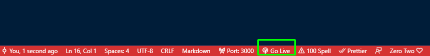

# Controle-de-Produtos

Página de controle de produtos feito em HTML, CSS e JavaScript

### 📋 Pré-requisitos

Vs Code e navegador

### 🔧 Instalação

Abra o projeto no Vs code

```
Inicie o Go Live:



```

Abra o Navegador:

```
Busque o Localhost

http://127.0.0.1:5500/


```
## ✒️ Autores

* **Matheus Borges** - *Desenvolvedor* - [matheusborges](https://github.com/Matheus-Borges-Never)

## 🎁 Expressões de gratidão

* Conte a outras pessoas sobre este projeto 📢;
* Me convide para um café;

---
⌨️ com ❤️ por [Matheus Borges](https://github.com/Matheus-Borges-Never) 😊